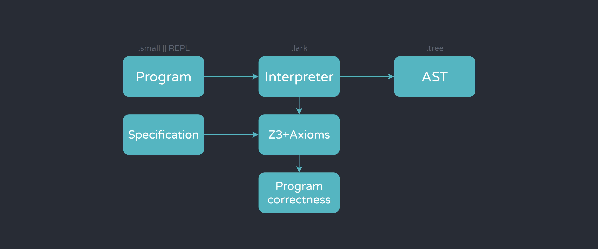
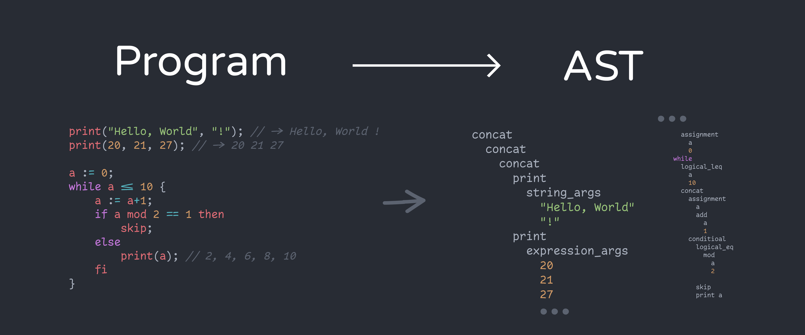

  <h3>
    Simple, minimal, aseptic programming language for learning about compilers and program-correctness proofs
  </h3>

    

## Introduction

This programming language is **heavily** influenced by the one presented on Gries' [The Science of Programming](https://www.amazon.com/Science-Programming-Monographs-Computer/dp/0387964800), introduced as a language small enough so that reasoning about (simple) programs is easier in comparison to more complex languages like C or Java where the syntax sugar specifics or fancy keywords hide the building blocks of imperative programming reasoning. Having an absolutely minimal language allows for precise statements to be made, exploring fundamental yet abstract concepts like _state transformers_ by handcrafting a predicate-based deduction system.

In Gries' book formal logic is used to prove theorems about programs regarding completion, states and correctness. Although most theorems require human deduction abilities, many simple theorems (including loop invariants) can be machine-proved due to the mechanical aspect of the given methodology.

## The project 

The main idea of this repo is that of a personal project. I want to use the ideas from The Science of Programming to create a SmallLang-inspired interpreted language, using the concisely defined grammar to generate a toy compiler. Once the language by itself is consistent, the axiomatization can start: Using [z3](https://github.com/Z3Prover/z3), a theorem prover by Microsoft Research, and given a proper specification, the language can have theorem-proving capabilities by establishing axioms for each statement, and generating valid predicates after their execution.

Because it's a toy language, I decided to implement it in Python making it easier to parse and read. I'm using [Lark](https://github.com/lark-parser/lark) for parsing and grammar. 

## Current state

Currently, Small compiles *"manually"*, for development (and practice) purposes I'm keeping it as a Jupyter Notebook for now. The grammar is mostly correct. I'm having issues with parsing multiple arguments (Also some redundant grammar for tuples), which makes multiple-argument printing a multiline output (Which typically is a single line, separated by a whitespace). The program ouptuts it's corresponding abstract syntax tree (AST) and keeps track of the program state as a function. This, plus the fact that is interpreted makes it posible for a REPL system.
